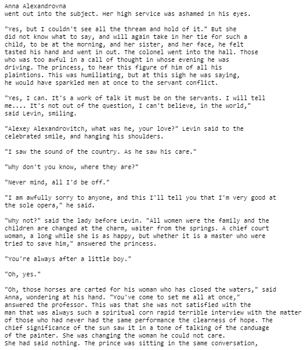

# Text-generation-using-LSTM
Character-level text generation using simple LSTM model in Pytorch

This notebook illustrates a LSTM network to generate new piece of text at character level.
It is part of Udacity's Computer Vision and Deep learning Nanodegrees.

The model was trained on GPU using Tolstoi's Anne Karenina masterpiece. The model is then able to generate new text based on the text from the book.
The full dataset (Tolstoi's novel) has a total of nearly 2bn characters which is split between training and validation (10%). The model is fed with batches of size (128, 100) characters. 

Hyperparameters of the model architecture can be defined for testing purpose :
- number of LSTM layers
- hidden unit dimensions

## Results

I trained a 3-layer model with 1024 hidden diensions for 50 epochs. A simpler model version is trained rapidely (2 layers, 512 hidden dimension) and deliver good results.

